<html>
<head>
<meta name="viewport" content="width=device-width, initial-scale=1">

</head>

<body>

  <h1> <a href="#subject_pool_management">Subject_Pool</a> <a href="#orsee_management">Orsee</a> 
  <a href="#lab_software_tutorial">Lab_Software</a> </h1> 

</body>
</html>

--- 

This is documentation is a brief introduction of some basic lab management for LEEPS lab, UCSC. 

--- 

<h2>Subject Pool Management</h2>  

This section introduces how should we maintain our subject pools for our lab. There are three steps we need to do:

Step 1: Find subjects' information. We need to use MyUCSC to download students' names and email addresses so that we can send them emails to invite them register into our Orsee system. 

Step 2: Clean the data. The data we find from step 1 cannot be used directly for sending emails. We need to clean the date first using some <code> R </code> code. 

Step 3: Send out mass emails for registration invitaiton. See step 3 below for details of how we do it.

   Acquiring Subjects Information 

First of all, go to "My UCSC". On the top, change “student homepage” to “faculty homepage”. See below:

    

Then click on “Faculty Center”:

    

Then From “My schedule”, find out the class number. Go to “search all class rosters”, enter that class number (be careful with the terms, search the right terms you are looking for, otherwise there is not result). You’ll see the list of all students in that class. On the same page, you will find a option to download students' information as an excel sheet, click that to download it. See below:

    

Now you have downloaded the data you need. Go to next section "Data Cleaning" to find the <code>R</code> code to clean the data.

<a href="#top">Back to top</a>

  Data Cleaning 

First of all, you need to re-save all the downloaded data to <code>.csv</code> file. Then follow the <code>R</code> code below to clean the data.

<pre>
  <code class = "language-r">
# First, read your .csv data in R (two examples below):
dta_1 <- read.csv(file = 'D:/zwang/Research/Leeps Lab/2023-winter-recruiting/data/all_data/Econ1.csv')
dta_2 <- read.csv(file = 'D:/zwang/Research/Leeps Lab/2023-winter-recruiting/data/all_data/Econ2.csv')

# After uploading your data to R, combine them together: 
dta <- rbind(dta_1,dta_2)

# Next, exclude duplicated students:
dta_unique <- dta[!duplicated(dta$ID), ]

# You don't need all the columns:
dta_unique <- dta_unique[c(-1,-2,-7,-8,-9,-11,-12,-13)]

  </code>
</pre>

<code>dta_1</code> and <code>dta_2</code> in the above code are data of Econ 1 and Econ 2. Of course, you will find a lot more classes than that. Say, you've found 100 classes from all different majors in total; each class has, on average, 200 students. In this case, your <code>dta_unique</code> will have approximately (but less than, due to excluding duplicated id) 20,000 unrepreated students. 

The following <code>R</code> explains how to divide them into smaller <code>.csv</code> files that contain only 300 students each. When sending mass emails (see next section), you might want to constrain the number of emails to send out each day to 300, otherwise, google might automatically categorize the emails as spam.

<pre>
  <code class = "language-r">
# Your dta_unique contains tens of thousands of students. First, shuffle all your students id:
dta_unique <- dta_unique[sample(nrow(dta_unique)),]

# Then save the first 300 students into another separate .csv file and call it students_s1:
students_s1 <- dta_unique[1:300,]

# Right below the above code, add your own name and email (in this example, I add myself Zhaoqi as one of the receivers), Kristian's email, and leeps lab's email into the .csv file:
library(tidyverse)
students_s1 <- students_s1 %>% 
  add_row(ID = 1000000, First.Name="Zhaoqi", Middle.Name="", Last.Name = "Wang",
          Level="", Gender..Pronoun="", Email.Address="zwang153@ucsc.edu")
students_s1 <- students_s1 %>% 
  add_row(ID = 1000000, First.Name="Kristian", Middle.Name="", Last.Name = "Lopez Vargas",
          Level="", Gender..Pronoun="", Email.Address="klopezva@ucsc.edu")
students_s1 <- students_s1 %>% 
  add_row(ID = 1000000, First.Name="Leeps", Middle.Name="", Last.Name = "Lab",
          Level="", Gender..Pronoun="", Email.Address="leeps@ucsc.edu")

# After adding the above three new contacts, save the .csv file:
write.csv(students_s1,"D:/zwang/Research/Leeps Lab/2023-winter-recruiting/data/combined_data/students_s1.csv", row.names = FALSE)

  </code>
</pre>

The above code explains steps to divide the first 300 students into a new <code>.csv</code> file. Of course, you need to repeat that many times until you divide all your <code>dta_unique</code> into many separate <code>.csv</code> files. Those files, named as "students_s1", "students_s2", "students_s3", and so on, are the <code>.csv</code> you need to use to send out mass emails each day. 

Note that adding your own email is necessary because you need to receive the email everyday yourself to check if the email was sent successfully. Including Kristian and Leeps as well so that they are both informed.

Now, you have all the data ready. Follow the steps in next section to send out mass emails everyday.

<a href="#top">Back to top</a>

Recruiting New Subjects via Email

We use <a href="https://ucsantacruz.co1.qualtrics.com/">Qualtrics Website</a> to send out the emails. Click the link and you need to login using the following user id and password:

ID: leeps   Password: "You know it..."

Follow the steps to prepare and send the emails.

1. Prepare Emails

1.1 Go to Directories

    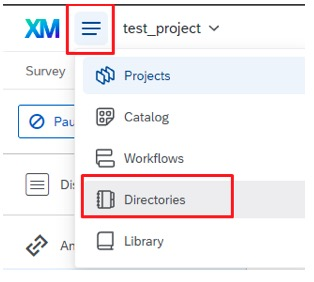

1.2. Click on "Create a List"

    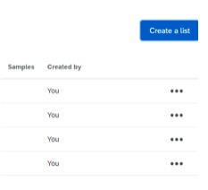

1.3. Assign it a name describing the current number of batch

    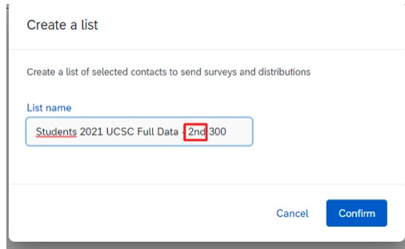

1.4. Choose Upload a File 

    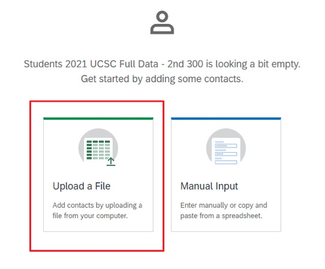

1.5. Choose the right delimiter

    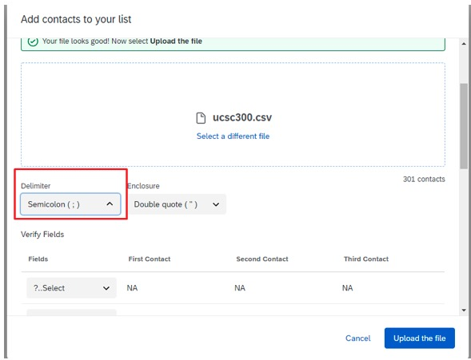

1.6. For the First/LastName and Email fields, choose manually their respective categories and click on Upload the File. 

    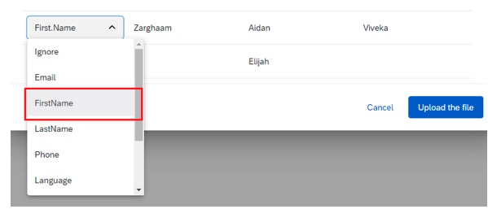

1.7. Click on Add your contacts. 

    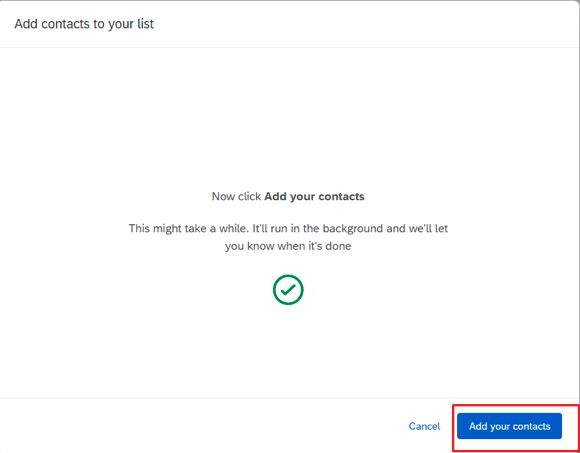

 2. Sending the emails 

 2.1. Go to the Test project from Qualtrics. 

    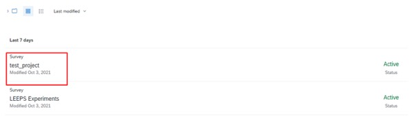

2.2. Click on Distributions. 

    

 2.3. Click on Emails. 

    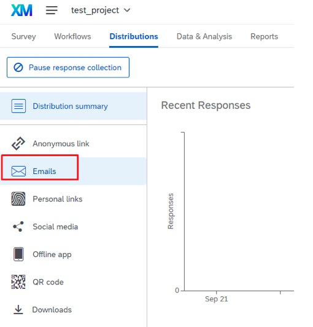

 2.4. Click on Compose email. 

    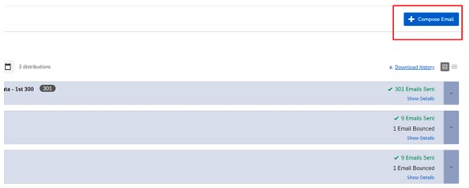

2.5. Fill the requested fields with its respective information. 

    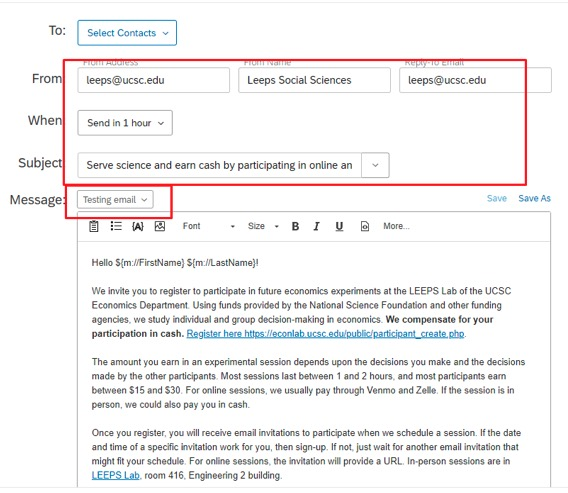

2.6. Choose the contacts you would like to send the email to. 

    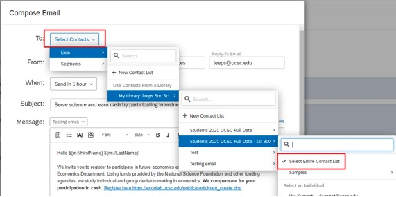

 2.7. Choose when to send the email and send the email. 

<a href="#top">Back to top</a>

<h2>Orsee Management</h2>  

This section introduces some basic usage of Orsee system. The first part explains how to create a new experiment and invite subjects for the sessions. The last three parts explains some useful tools that can help us resolve some of the potential problems we might encounter when using Orsee. 

 Create a New Experiment 

 1. Login to Leeps Lab ORSEE.3. Then Click Experiments_My Experiments: 

    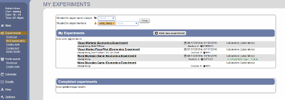

 2. If you are starting a new project with a new game, click “Add new experiment” at the center top of “My Experiment” box. Then you will reach the following pic. 

    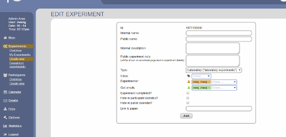

 You can enter “Internal name” and “Public name” for your new project’s game and click “Add”. 

 3. If you want to run more experiments for existing projects (game), then in step 1, click the name of that project. Here I use None Bayesian Game as an example. Click “None Bayesian Game” and go to the following picture. 

    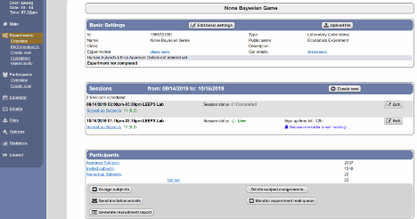

 Here, you can see how many experiments you’ve done for this project and the time of each experiment. If you plan to do another new experiment for this project, at “Sessions” box, click “Create new” to go next step. 

    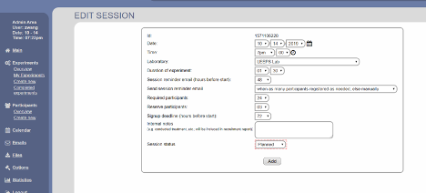

 4. Set the time you want for this experiment. For “Send session reminder email”, set “when as many participants registered as needed, else manually” so that it will send remind email to registered participants.

“Required participants” is how many subjects you need for this experiment.

“Reserve participants” is 2 or 3 extra participants in case required ones are not all coming. (We might need to reserve more participants after the pandemic)

“Signup deadline (hours before start)”: set this “0” so that they can register and come anytime they want even if it’s 1 min before the game.

“Session status”: when you are done with the above settings, set this “live”. (default is “planned”, but set it to “live”).

Then click “Add”. 

 5. Then go back to step 3, which is the main page for None Bayesian Game. Go to “Participants” box and click “Send invitation emails”, which shows below. 

    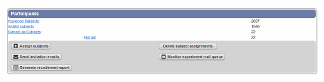

 6. Now you’ve reached the following figure. Don’t worry about anything, just click the very last button. 

You are all set! 

    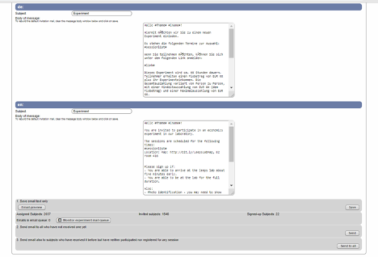

 Orsee "Options" 

 "Options" in Orsee provide many tools for us to manage the Orsee system. Click that and go to the next a few sections to see what problems it can help us with. 

    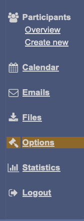

 What If the Email Queue Got Stuck? 

 Go to "Options" and find the following "System Setup". 

    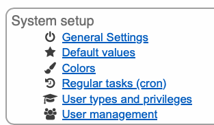

 Click "Regular Tasks (cron)".

Then from the figure below, find "process_mail_queue" and click "Run Now". This might help force the email to be sent out.

    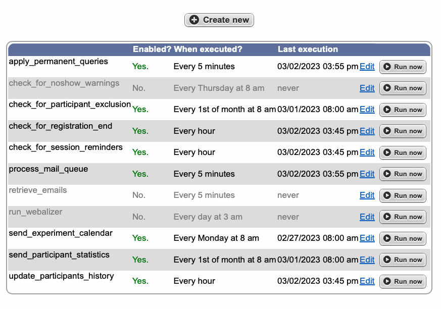

 Other Useful Options 

 Go to "Option", under "Communication and site content" (see figure below), we can change public content (what participants see from the orsee public website). Also, "Email Templates" is also helpful, we can use that to change email contents for each experiments. You can change the experiment type (online or in-person), change what you want to say in the reminder email, and so on. 

    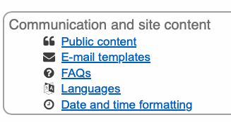

<h2>Lab Software Tutorial</h2>  

