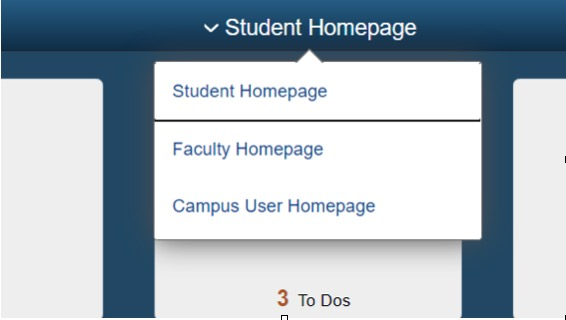
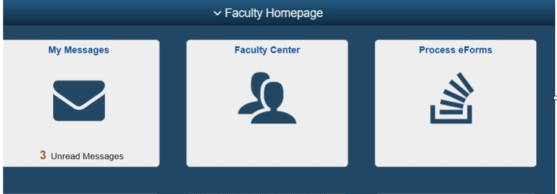
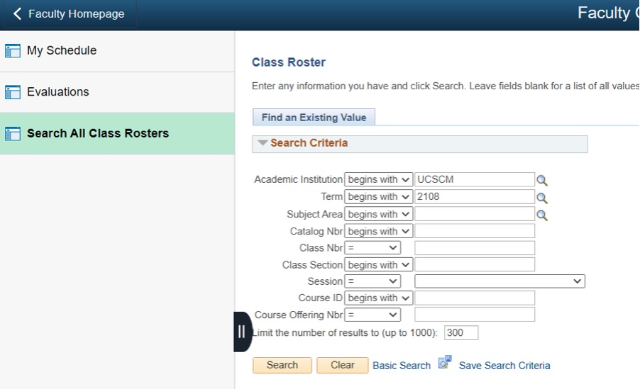

# Introduction

## Subject Pool Management

### Acquiring Subjects Information
First of all, go to "My UCSC". On the top, change “student homepage” to “faculty homepage”. 

Then click on “Faculty Center”:

Then From “My schedule”, find out the class number. Go to “search all class rosters”, enter that class number (be careful with the terms, search the right terms you are looking for, otherwise there is not result). You’ll see the list of all students in that class. On the same page, you will find a option to download students' information as an excel sheet, click that to download it.

### Recruiting New Subjects via Email

## Orsee Management

## Lab Software Tutorial
