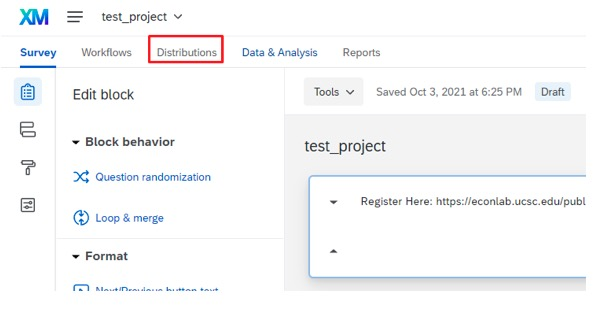

# Introduction

[Subject Pool Management](#subject-pool-management)

[Orsee Management](#orsee-management)

[Lab Software Tutorial](#lab-software-tutorial)

--- 

## Subject Pool Management

Acquiring Subjects Information

First of all, go to "My UCSC". On the top, change “student homepage” to “faculty homepage”. See below:

    

Then click on “Faculty Center”:

    

Then From “My schedule”, find out the class number. Go to “search all class rosters”, enter that class number (be careful with the terms, search the right terms you are looking for, otherwise there is not result). You’ll see the list of all students in that class. On the same page, you will find a option to download students' information as an excel sheet, click that to download it. See below:

    

Now you have downloaded the data you need. Go to next section "Data Cleaning" to find the <code>R</code> code to clean the data.

Data Cleaning

First of all, you need to re-save all the downloaded data to <code>.csv</code> file. Then follow the <code>R</code> code below to clean the data.

<pre>
  <code class = "language-r">
 # First, read your .csv data in R (two examples below):
dta_1 <- read.csv(file = 'D:/zwang/Research/Leeps Lab/2023-winter-recruiting/data/all_data/Econ1.csv')
dta_2 <- read.csv(file = 'D:/zwang/Research/Leeps Lab/2023-winter-recruiting/data/all_data/Econ2.csv')

# After uploading your data to R, combine them together: 
dta <- rbind(dta_1,dta_2)

# Next, exclude duplicated students:
dta_unique <- dta[!duplicated(dta$ID), ]

# You don't need all the columns:
dta_unique <- dta_unique[c(-1,-2,-7,-8,-9,-11,-12,-13)]

  </code>
</pre>

<code>dta_1</code> and <code>dta_2</code> in the above code are data of Econ 1 and Econ 2. Of course, you will find a lot more classes than that. Say, you've found 100 classes from all different majors in total; each class has, on average, 200 students. In this case, your <code>dta_unique</code> will have approximately (but less than, due to excluding duplicated id) 20,000 unrepreated students. 

The following <code>R</code> explains how to divide them into smaller <code>.csv</code> files that contain only 300 students each. When sending mass emails (see next section), you might want to constrain the number of emails to send out each day to 300, otherwise, google might automatically categorize the emails as spam.

<pre>
  <code class = "language-r">
 # Your dta_unique contains tens of thousands of students. First, shuffle all your students id:
dta_unique <- dta_unique[sample(nrow(dta_unique)),]

# Then save the first 300 students into another separate .csv file and call it students_s1:
students_s1 <- dta_unique[1:300,]

# Right below the above code, add your own name and email (in this example, I add myself Zhaoqi as one of the receivers), Kristian's email, and leeps lab's email into the .csv file:
library(tidyverse)
students_s1 <- students_s1 %>% 
  add_row(ID = 1000000, First.Name="Zhaoqi", Middle.Name="", Last.Name = "Wang",
          Level="", Gender..Pronoun="", Email.Address="zwang153@ucsc.edu")
students_s1 <- students_s1 %>% 
  add_row(ID = 1000000, First.Name="Kristian", Middle.Name="", Last.Name = "Lopez Vargas",
          Level="", Gender..Pronoun="", Email.Address="klopezva@ucsc.edu")
students_s1 <- students_s1 %>% 
  add_row(ID = 1000000, First.Name="Leeps", Middle.Name="", Last.Name = "Lab",
          Level="", Gender..Pronoun="", Email.Address="leeps@ucsc.edu")

# After adding the above three new contacts, save the .csv file:
write.csv(students_s1,"D:/zwang/Research/Leeps Lab/2023-winter-recruiting/data/combined_data/students_s1.csv", row.names = FALSE)

  </code>
</pre>

The above code explains steps to divide the first 300 students into a new <code>.csv</code> file. Of course, you need to repeat that many times until you divide all your <code>dta_unique</code> into many separate <code>.csv</code> files. Those files, named as "students_s1", "students_s2", "students_s3", and so on, are the <code>.csv</code> you need to use to send out mass emails each day. 

Note that adding your own email is necessary because you need to receive the email everyday yourself to check if the email was sent successfully. Including Kristian and Leeps as well so that they are both informed.

Now, you have all the data ready. Follow the steps in next section to send out mass emails everyday.

Recruiting New Subjects via Email

We use <a href="https://ucsantacruz.co1.qualtrics.com/">Qualtrics Website</a> to send out the emails. Click the link and you need to login using the following user id and password:

ID: leeps   Password: "You know it..."

Follow the steps to prepare and send the emails.

1. Prepare Emails

1.1 Go to Directories

    

1.2. Click on "Create a List"

    

1.3. Assign it a name describing the current number of batch

    

1.4. Choose Upload a File 

    

1.5. Choose the right delimiter

    

1.6. For the First/LastName and Email fields, choose manually their respective categories and click on Upload the File. 

    

1.7. Click on Add your contacts. 

    

 2. Sending the emails 

 2.1. Go to the Test project from Qualtrics. 

    

2.2. Click on Distributions. 

    

 2.3. Click on Emails. 

    

 2.4. Click on Compose email. 

    

2.5. Fill the requested fields with its respective information. 

    

2.6. Choose the contacts you would like to send the email to. 

    

 2.7. Choose when to send the email and send the email. 

## Orsee Management

## Lab Software Tutorial
